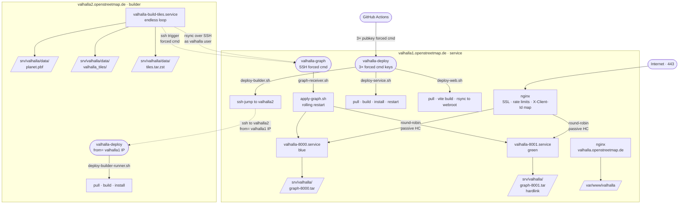

# Valhalla — operations & troubleshooting guide

Maintainer-facing doc for the FOSSGIS Valhalla deployment. For implementation
details (architecture invariants, why-not-X decisions, deeper code-side
context) see [../ai/valhalla.md](../ai/valhalla.md).

## Contents

- [Architecture](#architecture)
- [Components](#components)
  - [Hosts](#hosts)
  - [System users](#system-users)
  - [SSH trust paths](#ssh-trust-paths)
  - [systemd units](#systemd-units)
  - [nginx (valhalla1)](#nginx-valhalla1)
  - [Sentinels (monitoring signals)](#sentinels-monitoring-signals)
- [Common operations](#common-operations)
- [Vagrant end-to-end testing](#vagrant-end-to-end-testing)
  - [Browser test (web app + live routing)](#browser-test-web-app--live-routing)
  - [Without /etc/hosts (curl-only check)](#without-etchosts-curl-only-check)
- [Troubleshooting playbook](#troubleshooting-playbook)
  - [`/status` returns 502 (or 504) from nginx](#status-returns-502-or-504-from-nginx)
  - [One instance keeps restart-looping](#one-instance-keeps-restart-looping)
  - [No graph push happening](#no-graph-push-happening-sentinel-srvvalhallalast_apply_complete-stale)
  - [apply-graph fails or hangs on valhalla1](#apply-graph-fails-or-hangs-on-valhalla1)
  - [Web app stale or 404](#web-app-stale-or-404)
  - [nginx reload fails](#nginx-reload-fails-after-ansible-run-or-manual-edit)
  - [Rate limit firing too aggressively](#rate-limit-firing-too-aggressively)
  - [Disk full](#disk-full)
  - [Locked out of valhalla2 (builder)](#locked-out-of-valhalla2-builder)
- [Glossary](#glossary)

## Architecture

Two physical hosts, blue/green service on one, build loop on the other.



## Components

### Hosts

| host | role | what runs |
|---|---|---|
| valhalla1 (162.55.2.221) | service | nginx, two valhalla_service instances (ports 8000 + 8001), web app static files |
| valhalla2 (162.55.103.19) | builder | endless build-tiles loop, planet.pbf with rolling pyosmium updates |

### System users

| user | host(s) | shell | purpose |
|---|---|---|---|
| `valhalla` | both | `/bin/false` | runs valhalla services + build-tiles loop. owns `/src/valhalla`, `/srv/valhalla`. |
| `valhalla-graph` | valhalla1 | `/bin/bash` | receives graph tarballs from valhalla2 via rsync. authorized_key forces `graph-receiver.sh`. member of `valhalla` group so files inherit readability. |
| `valhalla-deploy` | valhalla1 | `/bin/bash` | receives GHA deploy triggers. 3 authorized_keys, each forces a different deploy script. |
| `valhalla-deploy` | valhalla2 | `/bin/bash` | receives builder-rebuild triggers from valhalla1. `from=` restricted to valhalla1's IP. |

### SSH trust paths

| keypair | private on | authorized on | forced command |
|---|---|---|---|
| graph push | valhalla2 (`valhalla` user, `~/.ssh/id_valhalla_graph`) | valhalla1 `valhalla-graph` | `graph-receiver.sh` (rsync→rrsync; bare ssh→`apply-graph.sh`) |
| builder deploy | valhalla1 (`valhalla-deploy`, `~/.ssh/id_valhalla_builder_deploy`) | valhalla2 `valhalla-deploy`, `from=` valhalla1's IP | `deploy-builder-runner.sh` |
| GHA deploys (×3) | GHA secrets | valhalla1 `valhalla-deploy` | one of: `deploy-service.sh` / `deploy-builder.sh` / `deploy-web.sh` |

### systemd units

| unit | host | trigger | what |
|---|---|---|---|
| `valhalla-8000.service`, `valhalla-8001.service` | valhalla1 | always running side-by-side | `valhalla_service /srv/valhalla/valhalla-{port}.json`. `CPUQuota = vcpus * 50%` per instance. |
| `valhalla-build-tiles.service` | valhalla2 | always running | `/srv/valhalla/scripts/build-tiles-loop.sh`. `Restart=always` with `StartLimitBurst=3` to surface persistent failures. |

### nginx (valhalla1)

- `/etc/nginx/conf.d/valhalla.conf` — upstreams + maps + log format + rate-limit zones (per-IP 1 r/s, per-IP /tile 10 r/s, global 500 r/s).
- `/etc/nginx/sites-enabled/valhalla1.openstreetmap.de` — API. `proxy_next_upstream error timeout http_502 http_503` so a stopped instance fails over transparently.
- `/etc/nginx/sites-enabled/valhalla.openstreetmap.de` — static SPA from `/var/www/valhalla` with vite-style fallback.
- Letsencrypt via the existing `valhalla__acme_certificates` mechanism (`group_vars/valhalla_service.yml` + common role's `acme_cert_client.yml`).

### Sentinels (monitoring signals)

| path | host | meaning | stale = |
|---|---|---|---|
| `/srv/valhalla/last_iteration_complete` | valhalla2 | mtime updated at end of each successful build/push/apply iteration | builder is broken or stuck |
| `/srv/valhalla/last_apply_complete` | valhalla1 | mtime updated at end of each successful apply-graph run | graph push or apply-graph is failing |

Threshold: `valhalla__sentinel_max_age_hours = 16`. Both stale = builder broken. Build fresh + apply stale = push or apply broken. Apply fresh implies build fresh.

## Common operations

```sh
# Service health from anywhere
curl -s https://valhalla1.openstreetmap.de/status | jq

# Live build-tiles log
ssh valhalla2 sudo journalctl -t valhalla-build-tiles -f

# Live apply-graph log
ssh valhalla1 sudo journalctl -t valhalla-apply-graph -f

# Per-flow deploy logs
sudo journalctl -t valhalla-deploy-service -n 50    # on valhalla1
sudo journalctl -t valhalla-deploy-builder -n 50    # on valhalla2
sudo journalctl -t valhalla-deploy-web -n 50        # on valhalla1
sudo journalctl -t valhalla-graph-receiver -p warning -n 50  # rejection log only

# Stop one valhalla instance (the other keeps serving via nginx fail-over)
sudo systemctl stop valhalla-8000      # on valhalla1
sudo systemctl start valhalla-8000

# Stop the build loop (e.g. for maintenance)
sudo systemctl stop valhalla-build-tiles    # on valhalla2

# Manually trigger a deploy script (when debugging the script logic, bypassing SSH/forced-cmd path)
sudo -u valhalla-deploy /srv/valhalla/scripts/deploy-service.sh
sudo -u valhalla-deploy /srv/valhalla/scripts/deploy-web.sh
sudo -u valhalla-deploy /srv/valhalla/scripts/deploy-builder.sh
```

## Vagrant end-to-end testing

`vagrant up valhalla-service valhalla-builder` + `make vagrant-valhalla`
brings the two VMs up at `192.168.123.10` (service) and `192.168.123.11`
(builder), bootstrapped from the same role used in prod against a small
Liechtenstein PBF. The vagrant overrides in [host_vars/valhalla-service.yml](../host_vars/valhalla-service.yml)
and [host_vars/valhalla-builder.yml](../host_vars/valhalla-builder.yml) point
the cross-host SSH targets at the private-network IPs and shrink the planet
input; the production hostnames stay in nginx so the rendered config matches
what runs in prod.

### Browser test (web app + live routing)

The nginx server blocks match on `Host:` header (production hostnames), so
hitting `http://192.168.123.10/` by raw IP just lands on nginx's default
welcome page. Two one-time steps get you a real end-to-end browser test:

1. Map both production names to the service VM's private IP in your
   workstation's `/etc/hosts`:

   ```sh
   echo "192.168.123.10 valhalla.openstreetmap.de valhalla1.openstreetmap.de" \
       | sudo tee -a /etc/hosts
   ```

   Remove the line when you're done — production DNS will take over once the
   real hosts go live.

2. Accept the snake-oil TLS cert **for each hostname separately** (browsers
   pin acceptance per-host). Visit each URL once and click through the
   warning:
   - `https://valhalla.openstreetmap.de/` — the web app site
   - `https://valhalla1.openstreetmap.de/status` — the API site

   Skipping step 2 for `valhalla1` shows up as a CORS error in the browser
   console when the SPA tries to fetch the API — the browser silently
   refuses the cross-origin TLS handshake and reports it as CORS rather
   than as a cert problem.

Then open `https://valhalla.openstreetmap.de/` and route between two points
inside Liechtenstein (e.g. Vaduz `47.1410, 9.5209` ↔ Schaan `47.1644, 9.5089`).
A request outside that bounding box will fail with "no path found".

### Without /etc/hosts (curl-only check)

For headless smoke tests, `curl --resolve` does the same job per-call:

```sh
curl -k --resolve valhalla1.openstreetmap.de:443:192.168.123.10 \
    https://valhalla1.openstreetmap.de/status

curl -k --resolve valhalla1.openstreetmap.de:443:192.168.123.10 \
    -H 'Content-Type: application/json' -X POST \
    https://valhalla1.openstreetmap.de/route \
    -d '{"locations":[{"lat":47.1410,"lon":9.5209},{"lat":47.1644,"lon":9.5089}],"costing":"auto"}' \
    | jq '.trip.summary'
```

The route call returns `{"length":..., "time":..., ...}` if everything's wired up.

## Troubleshooting playbook

Triage by what's broken from the **outside**, then drill in.

### `/status` returns 502 (or 504) from nginx

**Likely**: both valhalla instances down, OR no graph yet (fresh deploy).

```sh
# On valhalla1:
sudo systemctl is-active valhalla-8000 valhalla-8001
ls -la /srv/valhalla/graph-*.tar

# If services are inactive but graph exists:
sudo systemctl restart valhalla-8000 valhalla-8001
sleep 30 && curl -s http://127.0.0.1:8000/status

# If graph is missing — builder hasn't pushed yet. See "no graph push" below.

# If services are active but /status fails — check the actual port:
curl -fsm 5 http://127.0.0.1:8000/status
sudo journalctl -u valhalla-8000 -n 50
```

If valhalla-8000 hangs but valhalla-8001 responds (or vice versa), nginx round-robin will time out half the requests until `proxy_read_timeout` fails over. Restart the wedged instance.

### One instance keeps restart-looping

**Likely**: corrupt graph file, missing `valhalla-{port}.json`, missing IPC socket cleanup, OOM.

```sh
sudo systemctl status valhalla-8000     # see exit code + recent restarts
sudo journalctl -u valhalla-8000 -n 80  # find the actual error

# Common errors:
#   "Could not parse json, error at offset: 0"
#     → /srv/valhalla/valhalla-8000.json missing or empty. Re-run ansible.
#   "Address already in use"
#     → IPC socket left behind by prior process. Stop both instances, then:
#       sudo rm /tmp/valhalla-{8000,8001}-{loki,thor,odin,meili,loopback,interrupt}
#     and start them again.
#   "Tile extract could not be loaded"
#     → graph-{port}.tar missing/corrupt. Trigger a fresh apply-graph (see below).
```

### No graph push happening (sentinel `/srv/valhalla/last_apply_complete` stale)

**Likely**: build-tiles loop crashing repeatedly, or rsync/SSH from valhalla2→valhalla1 broken.

```sh
# On valhalla2 (builder):
sudo systemctl status valhalla-build-tiles
sudo journalctl -u valhalla-build-tiles -n 80

# StartLimitBurst hit (3 quick failures):
sudo systemctl reset-failed valhalla-build-tiles
sudo systemctl start valhalla-build-tiles

# SSH/rsync to valhalla1 broken — test:
sudo -u valhalla ssh -i /srv/valhalla/.ssh/id_valhalla_graph valhalla-graph@valhalla1.openstreetmap.de
# (Should print only the apply-graph status output, then disconnect — forced cmd.)
# If "Permission denied", the authorized_key on valhalla1 is wrong;
# re-run `make valhalla` to refresh.

# pyosmium-up-to-date failing — best-effort, doesn't abort the loop;
# look for "pyosmium-up-to-date FAILED" in the journal.
```

### apply-graph fails or hangs on valhalla1

**Likely**: missing curl on valhalla1 (healthcheck dep), wrong sudoers, graph file race.

```sh
# On valhalla1:
sudo journalctl -t valhalla-apply-graph -n 50

# "valhalla-{port} did not become healthy in 60s" with no curl logs:
which curl    # if not installed, re-run ansible (curl is in service.yml apt list)

# Sudoers — valhalla-graph must be able to systemctl stop/start the per-port units:
sudo -u valhalla-graph sudo -n -l    # should list the systemctl rules

# Graph tarball corrupt:
sudo zstd -t /srv/valhalla-graph/tiles.tar.zst    # test integrity
# If bad, the next build-tiles iteration will overwrite it.
```

### Web app stale or 404

**Likely**: deploy-web.sh failed (GHA logs), or the rsync to webroot didn't run.

```sh
# On valhalla1:
sudo journalctl -t valhalla-deploy-web -n 50
ls -la /var/www/valhalla/index.html    # mtime should reflect last deploy

# Run the deploy script manually to see real-time output:
sudo -u valhalla-deploy /srv/valhalla/scripts/deploy-web.sh
```

### nginx reload fails (after ansible run or manual edit)

```sh
sudo nginx -t                                    # verbose config check
sudo journalctl -xeu nginx.service -n 30

# Common: missing cert file
# "cannot load certificate '/srv/acme-daemon/certs/foo.pem'"
# → That cert isn't declared in group_vars/valhalla_{service,builder}.yml.
# Add the entry to __acme_certificates and re-run common.
```

### Rate limit firing too aggressively

The role configures per-IP routing at 1 r/s, per-IP `/tile` at 10 r/s, global at 500 r/s. If legitimate users hit 429, tune in `roles/valhalla/templates/nginx-valhalla.conf.j2` and reload nginx.

### Disk full

```sh
# Check the suspects (largest first):
sudo du -shx /srv/valhalla/* 2>/dev/null | sort -h
# Builder usually dominated by:
#   data/planet.pbf            (~80 GB)
#   data/valhalla_tiles/        (varies)
#   data/elevation/             (depends on bbox)
# Service host:
#   graph-{8000,8001}.tar       (the tarball + its hardlink)
#   /srv/valhalla-graph/tiles.tar.zst
```

### Locked out of valhalla2 (builder)

Builder isn't reachable from the public internet. ProxyJump through valhalla1:
```sh
ssh -J your-admin@valhalla1.openstreetmap.de root@valhalla2.openstreetmap.de
```

## Glossary

- **blue/green** — both `valhalla-8000` and `valhalla-8001` run side-by-side at steady state. apply-graph stops/swaps/starts each in turn during a graph rotation; nginx fails over passively. There is no "currently-active" state file.
- **drain_seconds** — `--httpd-service-drain-seconds` in valhalla.json; how long `systemctl stop` blocks waiting for in-flight requests.
- **forced command SSH** — `command="…"` in authorized_keys. Whatever the client tries to run is overridden by the forced command. Used everywhere SSH is keyed in this setup.
- **sentinel** — a file whose mtime is the monitoring signal for "this thing finished successfully recently".
