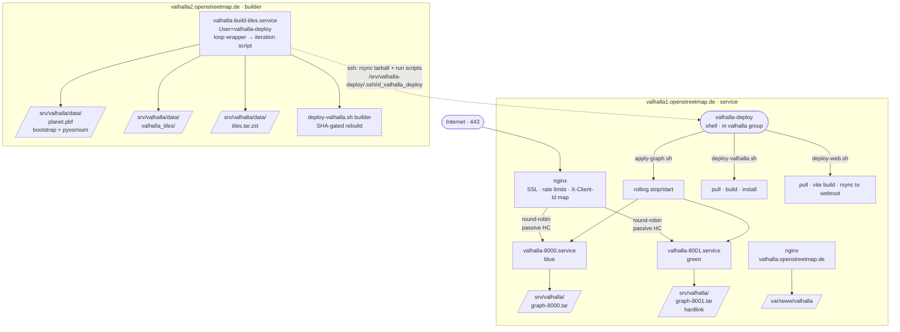

# Valhalla — operations & troubleshooting guide

Maintainer-facing doc for the FOSSGIS Valhalla deployment. For implementation
details (architecture invariants, why-not-X decisions, deeper code-side
context) see [../ai/valhalla.md](../ai/valhalla.md).

## Contents

- [Architecture](#architecture)
- [Secrets (ansible-vault)](#secrets-ansible-vault)
- [Components](#components)
  - [Hosts](#hosts)
  - [System users](#system-users)
  - [SSH trust paths](#ssh-trust-paths)
  - [systemd units](#systemd-units)
  - [nginx (valhalla1)](#nginx-valhalla1)
  - [TLS / Let's Encrypt](#tls--lets-encrypt)
  - [Sentinels (monitoring signals)](#sentinels-monitoring-signals)
  - [Munin graphs](#munin-graphs)
  - [Prometheus / Grafana](#prometheus--grafana)
  - [Tarball download endpoint](#tarball-download-endpoint)
- [Common operations](#common-operations)
- [Routine maintenance](#routine-maintenance)
  - [Update the valhalla branch / tag / SHA](#update-the-valhalla-branch--tag--sha)
  - [Update prime_server](#update-prime_server)
  - [Update the web-app](#update-the-web-app)
  - [Tune `valhalla.json` (service limits, mvt cache, statsd, ...)](#tune-valhallajson-service-limits-mvt-cache-statsd-)
  - [Tune nginx (rate limits, server blocks)](#tune-nginx-rate-limits-server-blocks)
  - [Change `valhalla__planet_url`](#change-valhalla__planet_url)
  - [Resize / re-spec the v1 host (CPU thread count, CPUQuota)](#resize--re-spec-the-v1-host-cpu-thread-count-cpuquota)
  - [Rotate the orchestrator SSH key](#rotate-the-orchestrator-ssh-key)
  - [Bump `statsd_exporter` version](#bump-statsd_exporter-version)
  - [What auto-updates without operator action](#what-auto-updates-without-operator-action)
- [Vagrant end-to-end testing](#vagrant-end-to-end-testing)
  - [Browser test (web app + live routing)](#browser-test-web-app--live-routing)
  - [Without /etc/hosts (curl-only check)](#without-etchosts-curl-only-check)
- [Troubleshooting playbook](#troubleshooting-playbook)
  - [`/status` returns 502 (or 504) from nginx](#status-returns-502-or-504-from-nginx)
  - [One instance keeps restart-looping](#one-instance-keeps-restart-looping)
  - [No graph push happening](#no-graph-push-happening-sentinel-srvvalhallalast_apply_complete-stale)
  - [apply-graph fails or hangs on valhalla1](#apply-graph-fails-or-hangs-on-valhalla1)
  - [Web app stale or 404](#web-app-stale-or-404)
  - [nginx reload fails](#nginx-reload-fails-after-ansible-run-or-manual-edit)
  - [Rate limit firing too aggressively](#rate-limit-firing-too-aggressively)
  - [Disk filling up on valhalla1 (mvt cache)](#disk-filling-up-on-valhalla1-mvt-cache)
  - [Locked out of valhalla2 (builder)](#locked-out-of-valhalla2-builder)
  - [Vagrant: VM has no internet (apt hangs, ping 1.1.1.1 times out)](#vagrant-vm-has-no-internet-apt-hangs-ping-1111-times-out)
  - [Submodule fetch fails (`upload-pack: not our ref …`)](#submodule-fetch-fails-upload-pack-not-our-ref-)
- [Glossary](#glossary)

## Architecture

Two physical hosts, blue/green service on one (rolling deploy), build loop on the other.



## Secrets (ansible-vault)

Secrets for the valhalla role live in
[../group_vars/valhalla/vault.yml](../group_vars/valhalla/vault.yml),
encrypted with `ansible-vault`. The file is loaded alongside
[../group_vars/valhalla/vars.yml](../group_vars/valhalla/vars.yml) for
the `[valhalla:children]` parent group, so both `valhalla_service` and
`valhalla_builder` hosts resolve the values.

| variable | location | when needed | description |
|---|---|---|---|
| `valhalla__ext_prometheus_in_use` | `defaults/` (or override in vars.yml) | enable Prometheus | `true` to install node_exporter / statsd_exporter / mtail and open ufw to the scraper. Default `false`. |
| `valhalla__prometheus_scraper_ip` | `vault.yml` | with `…_in_use: true` | Public IP of the routing.earth Prometheus host (proc-server). Used as `from_ip` on the ufw rules for ports 9100 / 9102 / 9145. Role asserts up front if missing. |
| `valhalla__download_in_use` | `defaults/` (or override in vars.yml) | enable `/download/` endpoint | `true` to render the htpasswd and the nginx `location =` blocks for `/download/tiles.tar{,.zst}`. Default `false`. |
| `valhalla__download_password` | `vault.yml` | with `…_in_use: true` | Cleartext password handed to `community.general.htpasswd` (bcrypt-hashed on disk). Role asserts up front if missing. |
| `valhalla__download_user` | `defaults/` (or override in vars.yml) | optional | Username for the download endpoint Basic Auth. Defaults to `fossgis`. |
| `valhalla__letsencrypt_in_use` | `defaults/` (or override in vars.yml) | always (gate) | `true` to run self-hosted certbot on valhalla1 (default). Vagrant overrides to `false`. See [TLS / Let's Encrypt](#tls--lets-encrypt). |
| `valhalla__letsencrypt_email` | `vault.yml` | with `…_in_use: true` | Let's Encrypt registration contact (expiry warnings + account recovery). Not on the public cert. |
| `users` | `vault.yml` | `bootstrap.yml` only | Admin user list — name + groups + ssh_public_keys. Drives `roles/common/tasks/accounts.yml`. Not read by `site.yml`. |

Working with the vault file:

```sh
# first-time encrypt (after committing the plaintext skeleton)
ansible-vault encrypt group_vars/valhalla/vault.yml

# edit (decrypts to tempfile, re-encrypts on save)
ansible-vault edit    group_vars/valhalla/vault.yml

# rotate the vault password
ansible-vault rekey   group_vars/valhalla/vault.yml
```

Pass the vault password to `ansible-playbook` with `--ask-vault-pass`,
or point `ANSIBLE_VAULT_PASSWORD_FILE` at a file with the password.

Admin SSH access (creating the human user accounts on valhalla1 / valhalla2
and dropping pubkeys + sudoers) is bootstrap-layer concern handled by
[../bootstrap.yml](../bootstrap.yml) +
[../roles/common/tasks/accounts.yml](../roles/common/tasks/accounts.yml).
That's not valhalla-specific — see the top-level [../README](../README).
If your account can't reach valhalla2 after a fresh provision, its `users`
entry probably doesn't list `valhalla_builder` (or `servers`) in
`groups:`.

## Components

### Hosts

| host | role | what runs |
|---|---|---|
| valhalla1 (162.55.2.221) | service | nginx, two valhalla_service instances (ports 8000 + 8001), web app static files |
| valhalla2 (162.55.103.19) | builder | endless build-tiles loop, planet.pbf with rolling pyosmium updates |

### System users

| user | host(s) | shell | purpose |
|---|---|---|---|
| `valhalla` | both | `/bin/false` | **runtime only**: runs `valhalla_service` (v1) + `/srv/valhalla/mvt-cache-*` owner. On v2 has no running service — exists as the owner of `/srv/valhalla` itself (sgid bucket). **zero sudoers** anywhere. On v1 cannot write the install prefix, so a service-side RCE can't self-overwrite. |
| `valhalla-deploy` | both | `/bin/bash` | **build + deploy identity** (same role on both hosts). Owns `/src/valhalla`, `/src/prime_server`, `/srv/valhalla/{local,data,scripts}`, `/srv/valhalla/web-app`, `/var/www/valhalla`. On v2 runs the build-tiles loop + holds the orchestrator SSH key. On v1 receives the orchestrator SSH login and runs `apply-graph.sh` / `deploy-valhalla.sh` / `deploy-web.sh` directly. member of `valhalla` group so v1's runtime can read what it writes. sudoers (v1 only): `systemctl` (per-port) + `nginx reload`. |

### SSH trust paths

| keypair | private on | authorized on | key_options |
|---|---|---|---|
| orchestrator | valhalla2 (`valhalla` user, `~/.ssh/id_valhalla_deploy`) | valhalla1 `valhalla-deploy` | (none — plain shell access) |

### systemd units

| unit | host | trigger | what |
|---|---|---|---|
| `valhalla-8000.service`, `valhalla-8001.service` | valhalla1 | always running side-by-side | `valhalla_service /srv/valhalla/valhalla-{port}.json <vcpus>`. Worker threads = full host vcpus per instance, no CPUQuota — kernel fair-shares when both hot, one instance bursts to the whole host while the other is stopped mid-apply-graph. |
| `valhalla-build-tiles.service` | valhalla2 | always running | `/srv/valhalla/scripts/build-tiles-loop.sh`. `Restart=always` with `StartLimitBurst=3` to surface persistent failures. |

### nginx (valhalla1)

- `/etc/nginx/conf.d/valhalla.conf` — upstreams + maps + log format + rate-limit zones (per-IP 1 r/s, per-IP /tile 10 r/s, global 500 r/s).
- `/etc/nginx/sites-enabled/valhalla1.openstreetmap.de` — API. `proxy_next_upstream error timeout http_502 http_503` so a stopped instance fails over transparently.
- `/etc/nginx/sites-enabled/valhalla.openstreetmap.de` — static SPA from `/var/www/valhalla` with vite-style fallback.
- Letsencrypt is **self-hosted on valhalla1** (certbot, NOT via the org's robinson-pushes-certs distribution). See [TLS / Let's Encrypt](#tls--lets-encrypt).

### TLS / Let's Encrypt

valhalla1 runs its own `certbot` instead of receiving certs from
robinson via the org's standard cert-distribution mechanism. We don't
have deploy access to robinson, so we can't fit into the org's flow
(robinson runs certbot, then SSHes back into each consumer host's
`acmeclnt` user and pushes the renewed PEM + key via `update_key`).

**The org's flow assumes** every host's nginx 301-redirects
`/.well-known/acme-challenge/*` to `acme.openstreetmap.de` (robinson).
That redirect is baked into the shared nginx `server()` macro at
[../roles/nginx/templates/nginx_site_macros.jinja](../roles/nginx/templates/nginx_site_macros.jinja).
For self-hosting on valhalla1 to work, **we override that redirect**:
[../roles/valhalla/templates/nginx-api.conf.j2](../roles/valhalla/templates/nginx-api.conf.j2)
and [../roles/valhalla/templates/nginx-web.conf.j2](../roles/valhalla/templates/nginx-web.conf.j2)
hand-roll their HTTP `listen 80;` server block (instead of using
`http='forward'`), serving the challenge from `/var/www/letsencrypt`.

**What runs:** [../roles/valhalla/tasks/tls.yml](../roles/valhalla/tasks/tls.yml),
gated to `valhalla_service` and `valhalla__letsencrypt_in_use: true`.
Default `true` in role defaults; vagrant overrides to `false` in
[../host_vars/valhalla-service.yml](../host_vars/valhalla-service.yml) because the VM has no public DNS.

The play does:

1. `apt install certbot`
2. `mkdir /var/www/letsencrypt` (owned by `www-data`)
3. Drops a one-line deploy-hook at `/etc/letsencrypt/renewal-hooks/deploy/reload-nginx` (just `systemctl reload nginx`).
4. Runs `certbot certonly --webroot -w /var/www/letsencrypt --cert-name <name> -d <domain> ...` once per entry in `valhalla__acme_certificates`. Idempotent via `creates:`.
5. **Symlinks** `/srv/acme-daemon/certs/<name>.pem` → `/etc/letsencrypt/live/<name>/fullchain.pem` (and `.key` → `privkey.pem`), replacing the snake-oil files that common's `acme_cert_client.yml` dropped earlier. Notifies a nginx reload.
6. Enables `certbot.timer` for unattended twice-daily renewals.

**Why symlinks**: certbot rotates the underlying cert files (in
`/etc/letsencrypt/archive/<name>/`) on each renewal and updates the
symlinks in `/etc/letsencrypt/live/<name>/` to point at the new ones.
Our outer symlink in `/srv/acme-daemon/certs/` then auto-tracks the
rotation — nothing needs to be copied or rewritten anywhere. The
deploy-hook is just `systemctl reload nginx` so nginx re-opens the
cert file via the live/ symlink.

**Renewal**: handled by debian's `certbot.timer` → `certbot.service` →
`certbot renew`. The deploy-hook fires for each renewed cert (just a
reload — symlinks already point at the new lineage). **No ansible run
needed for renewals.**

**Required vault var**: `valhalla__letsencrypt_email` in
[../group_vars/valhalla/vault.yml](../group_vars/valhalla/vault.yml)
— LE registration contact (expiry warnings + account recovery).

**Disabling self-hosting** (e.g. when robinson access becomes available):

```yaml
# group_vars/valhalla/vars.yml (or host_vars/valhalla1.yml)
valhalla__letsencrypt_in_use: false
```

Then either keep the snake-oil, or wire in `acme__distribution_account`
so the org's mechanism takes over. If you switch back, replace the
`/srv/acme-daemon/certs/<name>.{pem,key}` symlinks with real files
(otherwise the org's distribution would write through the symlinks
into certbot's tree), and optionally clean up `/etc/letsencrypt/`,
`/var/www/letsencrypt`, the deploy-hook, and disable `certbot.timer`
(the role doesn't remove them automatically).

**Smoke checks**:

```sh
# on valhalla1
ls -l /srv/acme-daemon/certs/                # *.pem + *.key as symlinks into /etc/letsencrypt/live/
certbot certificates                          # lineage list + expiry
systemctl list-timers certbot.timer           # next renewal check time
sudo /etc/letsencrypt/renewal-hooks/deploy/reload-nginx  # manual hook invocation

# from anywhere
curl -vk https://valhalla1.openstreetmap.de/status | head
openssl s_client -servername valhalla1.openstreetmap.de \
  -connect valhalla1.openstreetmap.de:443 < /dev/null 2>/dev/null \
  | openssl x509 -noout -issuer -dates
```

### Sentinels (monitoring signals)

| path | host | meaning | stale = |
|---|---|---|---|
| `/srv/valhalla/last_iteration_complete` | valhalla2 | mtime updated at end of each successful build/push/apply iteration | builder is broken or stuck |
| `/srv/valhalla/last_apply_complete` | valhalla1 | mtime updated at end of each successful apply-graph run | graph push or apply-graph is failing |

Threshold: `valhalla__sentinel_max_age_hours = 16`. Both stale = builder broken. Build fresh + apply stale = push or apply broken. Apply fresh implies build fresh.

### Munin graphs

> **Currently disabled.** The munin role is no longer pulled in by the
> valhalla role — `- role: munin` in `roles/valhalla/meta/main.yml`,
> the `include_tasks: munin.yml` in `roles/valhalla/tasks/main.yml`, and
> the `name: munin` entries in
> [../group_vars/valhalla_service.yml](../group_vars/valhalla_service.yml) +
> [../group_vars/valhalla_builder.yml](../group_vars/valhalla_builder.yml)
> are all commented out. munin-node is not installed, no
> `munin.<host>.openstreetmap.de` nginx site is rendered, and no
> valhalla munin plugins are dropped. The plugin templates +
> `tasks/munin.yml` are kept in the tree so re-enabling is a
> comment-toggle, not a rewrite. Until munin is re-enabled, treat the
> table below as documentation of what *would* be available.

The master scrapes the per-host munin-node and renders graphs under the
"valhalla" category. Plugins are installed by the role:

| plugin | host | what |
|---|---|---|
| `valhalla_count` | valhalla1 | req/s per endpoint (route, isochrone, matrix, tile, status, other) |
| `valhalla_latency` | valhalla1 | mean / p50 / p99 / max seconds over the last 5 min |
| `valhalla_consumers` | valhalla1 | req/s grouped by `X-Client-Id` class (`public-web-app`, `unknown`, ...) |
| `valhalla_tile_size` | valhalla2 | planet.pbf and tiles.tar.zst byte sizes |

To debug a plugin directly on the host (bypassing the master / network):

```sh
sudo munin-run valhalla_count            # fetch — values
sudo munin-run valhalla_count config     # config — graph definition
```

If `fetch` returns `U` for everything, the plugin lacks read permission on
its source (usually `/var/log/nginx/*.log` requires `group adm`, which the
role's `/etc/munin/plugin-conf.d/valhalla` grants). `valhalla_latency` also
returns `U` below 50 samples in the last 5 minutes — a single slow request
shouldn't pin the graph.

### Prometheus / Grafana

The role also installs three Prometheus exporters scraped by the
routing.earth monitoring stack:

| target | host | port | what |
|---|---|---|---|
| `prometheus-node-exporter` | both | 9100 | system metrics (CPU/mem/disk/net) |
| `statsd-exporter` | both | 9102 | builder: `valhalla_mjolnir_*` counters + bash-emitted `valhalla_mjolnir_timing_*` pipeline gauges. service: `valhalla_latency_seconds{action,service}` histogram + `valhalla_ok_total{action,service}` (mapped from per-request statsd) |
| `mtail` | valhalla1 only | 9145 | `nginx_http_requests_total{client,endpoint,status}` derived from `/var/log/nginx/valhalla-api.log` |

Enable per host group by setting `valhalla__ext_prometheus_in_use: true` in
`group_vars/valhalla_{service,builder}.yml` and supplying
`valhalla__prometheus_scraper_ip` in
[../group_vars/valhalla/vault.yml](../group_vars/valhalla/vault.yml)
(the public IP of proc-server). The play asserts up front if the scraper
IP is missing — ufw rules are gated on it, so leaving it empty is a no-go.

Smoke test on the host:

```sh
# system + valhalla counters (both hosts)
curl -s localhost:9100/metrics | head
curl -s localhost:9102/metrics | grep -E '^valhalla_'

# nginx request counter (service host only — generate traffic first)
curl -sH 'X-Client-Id: public-web-app' http://localhost/status
curl -s localhost:9145/metrics | grep '^nginx_http_requests_total'
```

Common failure modes:

- **`valhalla_latency_seconds_bucket` missing on the service host.** The
  histogram only exists when the statsd mapping config is loaded. Check
  `/etc/prometheus/statsd-mapping.yml` is present and that
  `systemctl cat statsd-exporter` shows `--statsd.mapping-config=…` in the
  ExecStart line.
- **`valhalla_mjolnir_*` empty on the builder.** Check the generated config
  has the top-level statsd block: `jq .statsd /srv/valhalla/valhalla.json`
  should show `{"host":"localhost","port":8125,...}`. If the file was
  generated before the `--statsd-host`/`--statsd-port` flags were added to
  [roles/valhalla/tasks/builder.yml](../roles/valhalla/tasks/builder.yml),
  delete the config and re-run the role — `creates:` makes that task skip
  when the file already exists.
- **`nginx_http_requests_total` empty.** mtail needs `adm` group to read the
  log — `systemctl cat mtail` should show `SupplementaryGroups=adm`. Also
  check `journalctl -u mtail | tail` for regex-mismatch warnings (the
  program at `/etc/mtail/valhalla-nginx.mtail` regex assumes the `valhalla_log`
  format defined in `nginx-valhalla.conf.j2` — if that format changes, the
  regex needs updating).
- **Scraper can't reach the ports.** `ufw status` should show three (service)
  or two (builder) rules with `ALLOW IN  from <scraper-ip>`. If absent,
  `valhalla__prometheus_scraper_ip` wasn't set; re-run the role.

### Tarball download endpoint

Optional Basic-Auth-protected download of the current graph in both forms,
on the API hostname. Disabled by default.

Enable by setting `valhalla__download_in_use: true` in `vars.yml` (or
`group_vars/valhalla_service.yml` if you want it scoped to valhalla1
only), and adding the password to the vault file:

```sh
ansible-vault edit group_vars/valhalla/vault.yml
```

```yaml
# in vault.yml (encrypted at rest)
valhalla__download_password: "<your shared credential>"
```

Optional override (defaults to `fossgis` from
[../roles/valhalla/defaults/main.yml](../roles/valhalla/defaults/main.yml)):

```yaml
# in vars.yml or another non-vault scope
valhalla__download_user: someone-else
```

URLs (against `valhalla__api_hostname`, e.g. `valhalla1.openstreetmap.de`):

| URL | What |
|---|---|
| `https://.../download/tiles.tar`     | uncompressed tile tarball — same file valhalla1 mmaps |
| `https://.../download/tiles.tar.zst` | zstd-compressed tarball, published at end of each apply |

Quick check:

```sh
# 401 without creds:
curl -sI -o /dev/null -w '%{http_code}\n' https://valhalla1.openstreetmap.de/download/tiles.tar.zst

# 200 with creds, plus Content-Length / Last-Modified / Content-Disposition:
curl -sI -u fossgis:<password> https://valhalla1.openstreetmap.de/download/tiles.tar.zst

# actual download:
curl -u fossgis:<password> -o tiles.tar.zst https://valhalla1.openstreetmap.de/download/tiles.tar.zst
```

Access logs land in `/var/log/nginx/valhalla-download.log` (separate from
`valhalla-api.log` so multi-GB transfers don't pollute the routing-request
metrics). The graph swap during a build is non-disruptive — an in-flight
download continues reading the pre-swap file via its open FD and finishes
correctly; new requests after the swap see the new graph. See
[ai/valhalla.md](../ai/valhalla.md) for the inode-survival reasoning.

Common failure modes:

- **404 on `/download/tiles.tar.zst` right after enabling.** The published
  copy at `/srv/valhalla/graph.tar.zst` is created at the *end* of an
  apply-graph run. Trigger one (or wait for the next build iteration), or
  smoke-test against `/download/tiles.tar` first — it exists as soon as a
  graph is loaded.

## Common operations

### Production

```sh
# Service health
curl -s https://valhalla1.openstreetmap.de/status | jq

# Live build-tiles log
ssh valhalla2 sudo journalctl -t valhalla-build-tiles -f

# Live apply-graph log
ssh valhalla1 sudo journalctl -t valhalla-apply-graph -f

# Per-flow deploy logs
ssh valhalla1 sudo journalctl -t valhalla-deploy-valhalla -n 50
ssh valhalla1 sudo journalctl -t valhalla-deploy-web -n 50

# Stop one valhalla instance (the other keeps serving via nginx fail-over)
ssh valhalla1 sudo systemctl stop valhalla-8000
ssh valhalla1 sudo systemctl start valhalla-8000

# Stop the build loop (e.g. for maintenance). This also pauses all
# orchestrator-driven rebuilds on v1, since the build loop is what
# invokes them.
ssh valhalla2 sudo systemctl stop valhalla-build-tiles

# Manually trigger a rebuild script (debugging the script logic; the build
# loop on v2 runs the same scripts automatically each iteration).
ssh valhalla1 sudo -u valhalla-deploy /srv/valhalla/scripts/deploy-valhalla.sh service
ssh valhalla2 sudo -u valhalla-deploy /srv/valhalla/scripts/deploy-valhalla.sh builder
ssh valhalla1 sudo -u valhalla-deploy /srv/valhalla/scripts/deploy-web.sh
ssh valhalla1 sudo -u valhalla-deploy /srv/valhalla/scripts/apply-graph.sh
```

### Vagrant

VMs are `valhalla-service` (= valhalla1) and `valhalla-builder` (= valhalla2).
The inner commands are identical — only the transport changes.

```sh
# Service health (snake-oil cert + curl --resolve so the Host header matches
# the production server_name without editing /etc/hosts)
curl -k --resolve valhalla1.openstreetmap.de:443:192.168.123.10 \
    https://valhalla1.openstreetmap.de/status | jq

# Live build-tiles log
vagrant ssh valhalla-builder -- -T 'sudo journalctl -t valhalla-build-tiles -f'

# Live apply-graph log
vagrant ssh valhalla-service -- -T 'sudo journalctl -t valhalla-apply-graph -f'

# Per-flow deploy logs
vagrant ssh valhalla-service -- -T 'sudo journalctl -t valhalla-deploy-valhalla -n 50'
vagrant ssh valhalla-service -- -T 'sudo journalctl -t valhalla-deploy-web -n 50'

# Stop one valhalla instance
vagrant ssh valhalla-service -- -T 'sudo systemctl stop valhalla-8000'
vagrant ssh valhalla-service -- -T 'sudo systemctl start valhalla-8000'

# Stop the build loop (also pauses orchestrator-driven rebuilds on v1)
vagrant ssh valhalla-builder -- -T 'sudo systemctl stop valhalla-build-tiles'

# Manually trigger a rebuild script
vagrant ssh valhalla-service -- -T 'sudo -u valhalla-deploy /srv/valhalla/scripts/deploy-valhalla.sh service'
vagrant ssh valhalla-builder -- -T 'sudo -u valhalla-deploy /srv/valhalla/scripts/deploy-valhalla.sh builder'
vagrant ssh valhalla-service -- -T 'sudo -u valhalla-deploy /srv/valhalla/scripts/deploy-web.sh'
vagrant ssh valhalla-service -- -T 'sudo -u valhalla-deploy /srv/valhalla/scripts/apply-graph.sh'
```

## Routine maintenance

Most config changes follow the same shape: edit the relevant variable
or template in the repo, then `make valhalla` to push it out. Ansible
is idempotent — re-runs are cheap and safe.

### Update the valhalla branch / tag / SHA

Edit `valhalla__git_version` in [roles/valhalla/defaults/main.yml](../roles/valhalla/defaults/main.yml)
(or override in group_vars / host_vars / -e on the command line).
Accepts a branch name, a tag, or a 40-char SHA — the role detects the
type via the same `length != 40` heuristic for shallow-vs-full clone.

```sh
make valhalla
```

What happens internally:
1. ansible's `git:` task is `update: no` — it only clones on a fresh
   host, doesn't touch an existing `/src/valhalla`. On re-runs this is
   a no-op.
2. `deploy-valhalla.sh` (run via ansible's task on each host) does the
   actual in-repo update: `git fetch + checkout + pull --ff-only +
   submodule update --init --recursive`. Then reads
   `{{ valhalla__prefix }}/.valhalla_installed_sha`, sees it doesn't
   match the new HEAD, runs `rm -rf build` + cmake + make + install.
3. New binary lands in `/srv/valhalla/local/bin/`; the marker file is
   updated.
4. On v1, the next apply-graph push will rolling-restart the per-port
   units → they pick up the new binary on start. To bring the new
   binary live sooner, either trigger apply-graph manually or
   `sudo systemctl restart valhalla-{8000,8001}` (one at a time, with
   a `/status` check in between, to preserve passive failover).
5. On v2, the new builder binary is picked up on the next iteration
   (each iteration spawns a fresh `valhalla_build_tiles` from the
   prefix). No manual restart needed.

For branch tracking (e.g., `valhalla__git_version: master`), the
build-tiles loop itself pulls + rebuilds at the start of every
iteration (step 0a/0b), so once `master` advances upstream you don't
need to do anything — the next iteration picks it up. Tag/SHA pins
are frozen; you only update them by changing the variable.

**If you're switching to a ref that's not reachable in the current
shallow clone** (e.g., from a branch to a tag that wasn't in master's
history), `deploy-valhalla.sh`'s `git fetch --tags origin` may not get
the new ref — the cleanest fix is to nuke the source tree and let the
role re-clone:

```sh
ssh valhalla1 sudo rm -rf /src/valhalla
ssh valhalla2 sudo rm -rf /src/valhalla
make valhalla
```

### Update prime_server

prime_server's ansible git task is `update: no` (same reasoning as
the valhalla checkout — avoid wedging submodule state under
`.git/modules/`). To pull a newer prime_server master, nuke the
source dir first so the task re-clones:

```sh
ssh valhalla1 sudo rm -rf /src/prime_server
make valhalla_service
```

If you need to pin prime_server to a specific commit/tag instead of
master, edit the `version: master` field in the
`Checkout prime_server source` task in [service.yml](../roles/valhalla/tasks/service.yml).
prime_server rebuilds rarely — pinning it is generally fine.

### Update the web-app

The web-app always tracks `master` on the upstream
`https://github.com/valhalla/web-app.git` repo and rebuilds itself
each iteration of the build-tiles loop (see step 0c in
[build-tiles-iteration.sh](../roles/valhalla/templates/build-tiles-iteration.sh.j2)).
So routine "new web-app commits" require no action — they roll out on
the next iteration.

To force an immediate rebuild without waiting:

```sh
ssh valhalla1 sudo -u valhalla-deploy /srv/valhalla/scripts/deploy-web.sh
```

To change the upstream URL or pin to a specific commit, edit
`valhalla__webapp_repo` in [group_vars/valhalla_service.yml](../group_vars/valhalla_service.yml)
and the `version:` in [roles/valhalla/tasks/web.yml](../roles/valhalla/tasks/web.yml)'s
`Checkout web-app source` task (currently hardcoded `version: master`).

### Tune `valhalla.json` (service limits, mvt cache, statsd, ...)

The per-port runtime configs at `/srv/valhalla/valhalla-{8000,8001}.json`
are generated by the
[Per-port valhalla.json](../roles/valhalla/tasks/service.yml)
task in service.yml from a single `valhalla_build_config …` invocation
with hardcoded flags. To change anything (request limits, drain
seconds, costing defaults, mvt cache settings, statsd host, ...):

```sh
# 1. Edit the flag list in roles/valhalla/tasks/service.yml
# 2. The task has `creates: …json` so it won't regenerate over the
#    existing file. Delete the old JSONs to force regeneration:
ssh valhalla1 sudo rm /srv/valhalla/valhalla-{8000,8001}.json
# 3. Re-run ansible:
make valhalla_service
# 4. apply-graph's next rolling restart picks up the new config, OR:
ssh valhalla1 sudo systemctl restart valhalla-8000 valhalla-8001
```

A nicer long-term shape would be a `notify: regen json` handler that
removes the file on flag-change so step 2 isn't needed — possible
follow-up.

### Tune nginx (rate limits, server blocks)

Edit the templates under [roles/valhalla/templates/nginx-*.conf.j2](../roles/valhalla/templates/).
The role's `notify: reload nginx` handler fires automatically when a
templated file changes, so:

```sh
make valhalla_service
```

is the whole loop. Zero downtime — nginx reloads in-place. If you
suspect a config-test failure, `sudo nginx -t` on v1 first.

### Change `valhalla__planet_url`

Defined in [group_vars/valhalla_builder.yml](../group_vars/valhalla_builder.yml)
(production: planet.osm.org) and overridden for vagrant in
[host_vars/valhalla-builder.yml](../host_vars/valhalla-builder.yml)
(Liechtenstein extract). Changes how the **initial** planet.pbf gets
downloaded by the build-tiles loop on first run.

Once a planet exists at `/srv/valhalla/data/planet.pbf`, the loop only
applies OSM diffs via `pyosmium-up-to-date` — it doesn't re-download.
To force a re-download against a new source URL:

```sh
ssh valhalla2 sudo rm /srv/valhalla/data/planet.pbf
# Next build-tiles iteration sees the file missing and wgets the new URL.
# Plan for ~20 min initial download for the global planet.
```

### Resize / re-spec the v1 host (CPU thread count, CPUQuota)

Both the worker thread count (`valhalla_service`'s positional arg)
and any CPU sizing scale off `ansible_facts.processor_vcpus`, which
ansible re-reads on every run. So after a VM resize / CPU
add/remove:

```sh
make valhalla_service
# Apply the new ExecStart (with the new thread count):
ssh valhalla1 sudo systemctl daemon-reload
ssh valhalla1 sudo systemctl restart valhalla-8000   # one at a time
ssh valhalla1 sudo systemctl restart valhalla-8001
```

### Rotate the orchestrator SSH key

The single keypair lives at `/srv/valhalla-deploy/.ssh/id_valhalla_deploy{,.pub}`
on valhalla2 (the builder, where it's generated by ansible's
`user: generate_ssh_key`). To rotate:

```sh
ssh valhalla2 sudo rm /srv/valhalla-deploy/.ssh/id_valhalla_deploy{,.pub}
# Both hosts in one run — v2 regenerates, v1's deploy.yml slurps the
# new pubkey and rewrites valhalla-deploy's authorized_keys:
make valhalla
```

### Bump `statsd_exporter` version

`valhalla__statsd_exporter_version` in
[roles/valhalla/defaults/main.yml](../roles/valhalla/defaults/main.yml).
The download task has `creates: /usr/local/bin/statsd_exporter`, so
just bumping the var doesn't trigger a re-download:

```sh
ssh valhalla1 sudo rm /usr/local/bin/statsd_exporter
ssh valhalla2 sudo rm /usr/local/bin/statsd_exporter
make valhalla
ssh valhalla1 sudo systemctl restart statsd-exporter
ssh valhalla2 sudo systemctl restart statsd-exporter
```

### What auto-updates without operator action

For sanity, here's the steady-state lifecycle — things that happen
every iteration without anyone doing anything:

| thing | trigger | source of truth |
|---|---|---|
| OSM data | `pyosmium-up-to-date` each iteration | replication URL in planet.pbf header |
| valhalla source (if `valhalla__git_version` is a branch) | `git fetch + pull` at the start of each iteration on both hosts | upstream branch |
| web-app | `git fetch + pull master` each iteration | `valhalla__webapp_repo` master branch |
| graph tarball | every successful iteration | the tile build itself |
| valhalla-{port} restart on v1 | every apply-graph (i.e., every successful iteration) | apply-graph.sh |

Branch-tracked updates roll forward automatically. Tag/SHA-pinned
updates need a `valhalla__git_version` edit + `make valhalla`.

## Vagrant end-to-end testing

`vagrant up valhalla-service valhalla-builder` + `make vagrant-valhalla`
brings the two VMs up at `192.168.123.10` (service) and `192.168.123.11`
(builder), bootstrapped from the same role used in prod against a small
Liechtenstein PBF. The vagrant overrides in [host_vars/valhalla-service.yml](../host_vars/valhalla-service.yml)
and [host_vars/valhalla-builder.yml](../host_vars/valhalla-builder.yml) point
the cross-host SSH targets at the private-network IPs and shrink the planet
input; the production hostnames stay in nginx so the rendered config matches
what runs in prod.

### Browser test (web app + live routing)

The nginx server blocks match on `Host:` header (production hostnames), so
hitting `http://192.168.123.10/` by raw IP just lands on nginx's default
welcome page. Two one-time steps get you a real end-to-end browser test:

1. Map both production names to the service VM's private IP in your
   workstation's `/etc/hosts`:

   ```sh
   echo "192.168.123.10 valhalla.openstreetmap.de valhalla1.openstreetmap.de" \
       | sudo tee -a /etc/hosts
   ```

   Remove the line when you're done — production DNS will take over once the
   real hosts go live.

2. Accept the snake-oil TLS cert **for each hostname separately** (browsers
   pin acceptance per-host). Visit each URL once and click through the
   warning:
   - `https://valhalla.openstreetmap.de/` — the web app site
   - `https://valhalla1.openstreetmap.de/status` — the API site

   Skipping step 2 for `valhalla1` shows up as a CORS error in the browser
   console when the SPA tries to fetch the API — the browser silently
   refuses the cross-origin TLS handshake and reports it as CORS rather
   than as a cert problem.

Then open `https://valhalla.openstreetmap.de/` and route between two points
inside Liechtenstein (e.g. Vaduz `47.1410, 9.5209` ↔ Schaan `47.1644, 9.5089`).
A request outside that bounding box will fail with "no path found".

### Without /etc/hosts (curl-only check)

For headless smoke tests, `curl --resolve` does the same job per-call:

```sh
curl -k --resolve valhalla1.openstreetmap.de:443:192.168.123.10 \
    https://valhalla1.openstreetmap.de/status

curl -k --resolve valhalla1.openstreetmap.de:443:192.168.123.10 \
    -H 'Content-Type: application/json' -X POST \
    https://valhalla1.openstreetmap.de/route \
    -d '{"locations":[{"lat":47.1410,"lon":9.5209},{"lat":47.1644,"lon":9.5089}],"costing":"auto"}' \
    | jq '.trip.summary'
```

The route call returns `{"length":..., "time":..., ...}` if everything's wired up.

## Troubleshooting playbook

Triage by what's broken from the **outside**, then drill in.

### `/status` returns 502 (or 504) from nginx

**Likely**: both valhalla instances down, OR no graph yet (fresh deploy).

```sh
# On valhalla1:
sudo systemctl is-active valhalla-8000 valhalla-8001
ls -la /srv/valhalla/graph-*.tar

# If services are inactive but graph exists:
sudo systemctl restart valhalla-8000 valhalla-8001
sleep 30 && curl -s http://127.0.0.1:8000/status

# If graph is missing — builder hasn't pushed yet. See "no graph push" below.

# If services are active but /status fails — check the actual port:
curl -fsm 5 http://127.0.0.1:8000/status
sudo journalctl -u valhalla-8000 -n 50
```

**Fresh-deploy timing window.** On a brand-new v1, `make valhalla` finishes
with the per-port units `enabled` but **stopped** — ansible doesn't run
`state: started` because starting valhalla_service without a tile-extract
just produces a half-broken instance. The first apply-graph push from v2
is what `systemctl start`s them, and that won't happen until v2 has done
its initial planet download (~20 min) + first full tile build (hours).
Until then, nginx has no upstream and returns 502. Just wait it out — or
if you want to confirm the timing, `ssh valhalla2 sudo journalctl -t
valhalla-build-tiles -f` shows iteration progress live.

**Reboot before first apply-graph (rare).** If v1 reboots in that window,
`WantedBy=multi-user.target` tries to auto-start the units, they fail
(no graph), and `StartLimitBurst=3` pins them as `failed`. Recover with
`sudo systemctl reset-failed valhalla-{8000,8001}` once the graph arrives
— or just `make valhalla` again, which is idempotent.

If valhalla-8000 hangs but valhalla-8001 responds (or vice versa), nginx round-robin will time out half the requests until `proxy_read_timeout` fails over. Restart the wedged instance.

### One instance keeps restart-looping

**Likely**: corrupt graph file, missing `valhalla-{port}.json`, missing IPC socket cleanup, OOM.

```sh
sudo systemctl status valhalla-8000     # see exit code + recent restarts
sudo journalctl -u valhalla-8000 -n 80  # find the actual error

# Common errors:
#   "Could not parse json, error at offset: 0"
#     → /srv/valhalla/valhalla-8000.json missing or empty. Re-run ansible.
#   "Address already in use"
#     → IPC socket left behind by prior process. Stop both instances, then:
#       sudo rm /tmp/valhalla-{8000,8001}-{loki,thor,odin,meili,loopback,interrupt}
#     and start them again.
#   "Tile extract could not be loaded"
#     → graph-{port}.tar missing/corrupt. Trigger a fresh apply-graph (see below).
```

### No graph push happening (sentinel `/srv/valhalla/last_apply_complete` stale)

**Likely**: build-tiles loop crashing repeatedly, or rsync/SSH from valhalla2→valhalla1 broken.

```sh
# On valhalla2 (builder):
sudo systemctl status valhalla-build-tiles
sudo journalctl -u valhalla-build-tiles -n 80

# StartLimitBurst hit (3 quick failures):
sudo systemctl reset-failed valhalla-build-tiles
sudo systemctl start valhalla-build-tiles

# SSH/rsync to valhalla1 broken — test as the user that owns the key:
sudo -u valhalla-deploy ssh -i /srv/valhalla-deploy/.ssh/id_valhalla_deploy \
    valhalla-deploy@valhalla1.openstreetmap.de echo ok
# (Should print "ok" and disconnect.)
# If "Permission denied", the authorized_key on valhalla1 is wrong;
# re-run `make valhalla` to refresh.

# pyosmium-up-to-date failing — best-effort, doesn't abort the loop;
# look for "pyosmium-up-to-date FAILED" in the journal.
```

### apply-graph fails or hangs on valhalla1

**Likely**: missing curl on valhalla1 (healthcheck dep), wrong sudoers, graph file race.

```sh
# On valhalla1:
sudo journalctl -t valhalla-apply-graph -n 50

# "valhalla-{port} did not become healthy in 60s" with no curl logs:
which curl    # if not installed, re-run ansible (curl is in service.yml apt list)

# Sudoers — valhalla-deploy must be able to systemctl stop/start the per-port units:
sudo -u valhalla-deploy sudo -n -l    # should list the systemctl rules

# Graph tarball corrupt:
sudo zstd -t /srv/valhalla-deploy/tiles.tar.zst    # test integrity
# If bad, the next build-tiles iteration will overwrite it.
```

### Web app stale or 404

**Likely**: `deploy-web.sh` failed during the orchestrator's iteration, or the rsync to webroot didn't run.

```sh
# On valhalla1:
sudo journalctl -t valhalla-deploy-web -n 50
ls -la /var/www/valhalla/index.html    # mtime should reflect last deploy

# Run the deploy script manually to see real-time output:
sudo -u valhalla-deploy /srv/valhalla/scripts/deploy-web.sh
```

### nginx reload fails (after ansible run or manual edit)

```sh
sudo nginx -t                                    # verbose config check
sudo journalctl -xeu nginx.service -n 30

# Common: missing cert file
# "cannot load certificate '/srv/acme-daemon/certs/foo.pem'"
# → That cert isn't declared in group_vars/valhalla_{service,builder}.yml.
# Add the entry to __acme_certificates and re-run common.
```

### Rate limit firing too aggressively

The role configures per-IP routing at 1 r/s, per-IP `/tile` at 10 r/s, global at 500 r/s. If legitimate users hit 429, tune in `roles/valhalla/templates/nginx-valhalla.conf.j2` and reload nginx.

### Disk filling up on valhalla1 (mvt cache)

**Likely**: per-port MVT cache directories under `/srv/valhalla/mvt-cache-{port}/`.
`valhalla_service` writes one file per rendered vector tile here (driven by
`--loki-service-defaults-mvt-cache-dir` in [valhalla.json](../roles/valhalla/tasks/service.yml)),
and the config sets no upper bound, so this dir grows unboundedly under
sustained `/tile` traffic. The cache is rebuildable — a missing tile just
gets re-rendered on the next request — so it's safe to wipe.

```sh
# On valhalla1: see what each cache is using
du -sh /srv/valhalla/mvt-cache-*

# Clear them in place. Safe while the services are running — open file
# handles in valhalla_service stay valid; new tiles just start fresh.
sudo find /srv/valhalla/mvt-cache-8000 /srv/valhalla/mvt-cache-8001 \
    -type f -delete

# Per-iteration trend: check the growth rate (delta between two runs
# of `du`) to decide how often this needs doing.
```

If this is happening regularly, the right fix is to either (a) cap the
cache via valhalla's own settings (look for an `mvt-cache-max-size` or
similar in the `valhalla_build_config` flags supported by the installed
valhalla version, and add it to the per-port `valhalla.json` generation
in [service.yml](../roles/valhalla/tasks/service.yml)), or (b) wire up a
periodic cleanup — e.g. a small systemd timer that runs the `find`
above weekly.

### Locked out of valhalla2 (builder)

Public DNS for valhalla2 resolves, port 22 is open via the common role's
`ufw allow OpenSSH`, and admin keys are deployed via `bootstrap.yml` (same
as every other host). If your account can't reach it: check that the
admin user entry under `users:` (read by
[../roles/common/tasks/accounts.yml](../roles/common/tasks/accounts.yml))
has `valhalla_builder` (or `servers`, or `all`) in its `groups:` list,
then re-run `bootstrap.yml`.

### Vagrant: VM has no internet (apt hangs, `ping 1.1.1.1` times out)

**Symptoms**: ansible's `Install valhalla build prerequisites` task on
valhalla-builder (or -service) hangs and eventually times out. Inside
the VM (`vagrant ssh valhalla-builder`), `getent hosts deb.debian.org`
resolves, `ping 192.168.121.1` (the gateway) succeeds, but
`ping 1.1.1.1` or `ping deb.debian.org` times out.

**Cause**: if you run docker on the same workstation, its daemon
installs nftables rules that set the `ip filter` FORWARD chain policy
to `drop` and only re-accept traffic on docker's own bridges
(`docker0`, `br-*`). Libvirt's `virbr*` bridges (which vagrant uses)
aren't whitelisted, so their forwarded traffic gets dropped — apt's
TCP connections to mirrors die mid-handshake. The legacy
`iptables -L FORWARD` shows nothing (docker uses iptables-nft, separate
storage); the smoking gun is `sudo nft list ruleset` showing
`chain FORWARD { ... policy drop; jump DOCKER-USER; jump DOCKER-FORWARD; }`.

**Quick temporary fix — stop docker, re-test, run the playbook, restart docker after**:

```sh
sudo systemctl stop docker docker.socket
# Re-test from inside the VM:
vagrant ssh valhalla-builder -- 'ping -c 3 1.1.1.1'
# If still no luck, docker also leaves rules behind — flush them:
sudo nft delete table ip filter
sudo nft delete table ip nat
sudo nft delete table ip6 filter
sudo nft delete table ip6 nat
sudo systemctl restart libvirtd
# Then re-run the failing playbook step.
# After you're done with vagrant work, you can `systemctl start docker`
# again — the same drop policy will come back unless you install the
# permanent fix below.
```

Before pulling the flush, confirm nothing important is in those tables:
`sudo nft list table ip filter | grep -v -E 'docker|DOCKER|^[[:space:]]*$|^table|^chain|^\}|hook|policy|counter'` —
if all that survives the grep is empty braces and chain headers,
the tables only hold docker-managed content and the flush is collateral-free.
(ufw lives in iptables-legacy, libvirt has its own `libvirt_network`
nft table — both unaffected.)

**Permanent fix** so this doesn't return every time the docker daemon
starts. First identify the libvirt bridge names on your workstation:

```sh
ip -br addr | grep 192.168.121     # → bridge for the default NAT network
ip -br addr | grep 192.168.123     # → bridge for the vagrant private_network
# (numbers may vary; substitute below)
```

Then install a systemd drop-in that re-adds DOCKER-USER allow rules
every time docker starts:

```sh
sudo mkdir -p /etc/systemd/system/docker.service.d
sudo tee /etc/systemd/system/docker.service.d/libvirt-passthrough.conf <<'EOF'
[Service]
# Substitute the two `virbrN` names with what `ip -br addr` showed above.
ExecStartPost=/usr/sbin/iptables -I DOCKER-USER -i virbr1 -j ACCEPT
ExecStartPost=/usr/sbin/iptables -I DOCKER-USER -o virbr1 -j ACCEPT
ExecStartPost=/usr/sbin/iptables -I DOCKER-USER -i virbr2 -j ACCEPT
ExecStartPost=/usr/sbin/iptables -I DOCKER-USER -o virbr2 -j ACCEPT
EOF
sudo systemctl daemon-reload
sudo systemctl restart docker      # picks up the drop-in
```

After this, docker can come and go without breaking vagrant networking.

### Submodule fetch fails (`upload-pack: not our ref …`)

**Symptoms**: ansible's `Build + install valhalla` (or the build-tiles
loop on v2, or `deploy-valhalla.sh` invoked manually) errors out with
something like:

```
Fetching submodule third_party/<name>
fatal: remote error: upload-pack: not our ref <SHA>
Errors during submodule fetch: third_party/<name>
```

**Cause**: stale state under `/src/valhalla/.git/modules/<name>/` from
a previous run that died mid-submodule-fetch. The cached submodule
state references a SHA the upstream submodule server now refuses to
serve (often because of a re-fetch attempting an old request). A fresh
`git clone --recursive` from the same machine succeeds because it
starts with no cached state — but the wedged repo can't recover via
`git submodule update --init` alone, and ansible's `git:` module's
`force` doesn't clean `.git/modules/`. Same wedge can affect
prime_server too.

**Fix**: nuke the source tree on the affected host(s) and re-run:

```sh
# Whichever host hit it (or both):
ssh valhalla1 sudo rm -rf /src/valhalla /src/prime_server
ssh valhalla2 sudo rm -rf /src/valhalla
make valhalla
```

The role's `Checkout valhalla source` task is `update: no` precisely
to keep this wedge from happening on subsequent ansible re-runs — but
once you're in it, manual cleanup is the only way out.

## Glossary

- **blue/green** — both `valhalla-8000` and `valhalla-8001` run side-by-side at steady state. apply-graph stops/swaps/starts each in turn during a graph rotation; nginx fails over passively. There is no "currently-active" state file.
- **drain_seconds** — `--httpd-service-drain-seconds` in valhalla.json; how long `systemctl stop` blocks waiting for in-flight requests.
- **orchestrator** — the build-tiles loop on valhalla2 in its role as the central driver. Each iteration it SHA-gate-rebuilds all three projects (valhalla on v2, valhalla on v1, web-app on v1), builds the graph, pushes it, and triggers the rolling restart. Single SSH key, no forced commands.
- **sentinel** — a file whose mtime is the monitoring signal for "this thing finished successfully recently".
